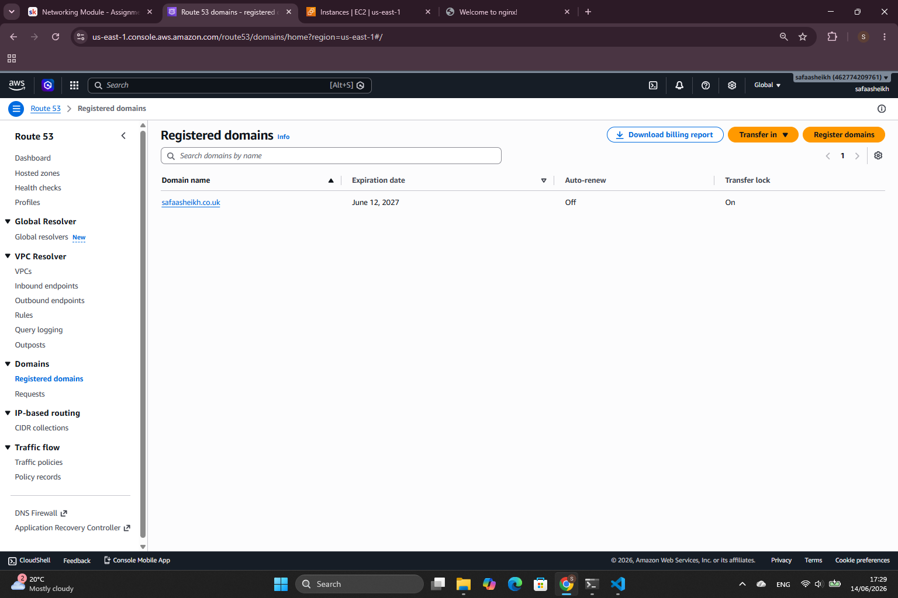
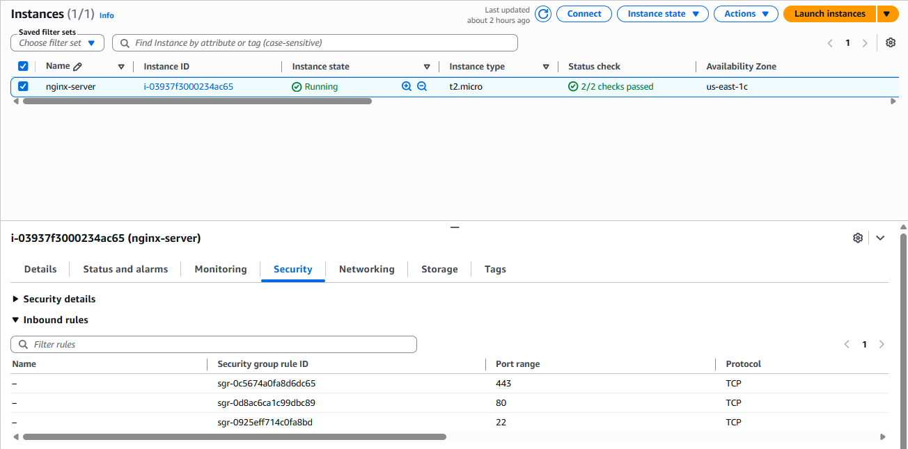
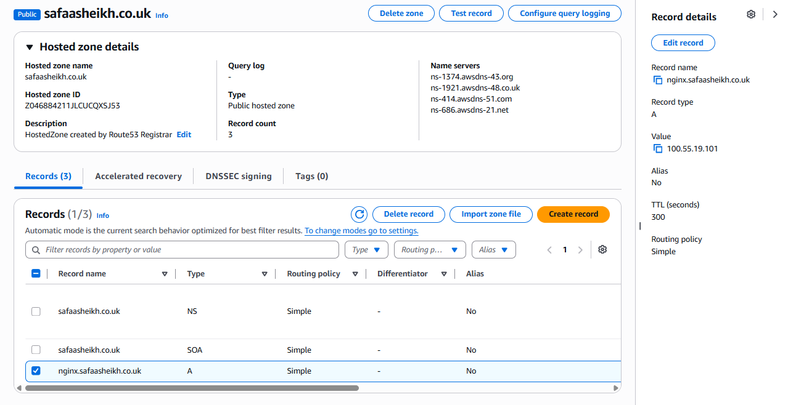
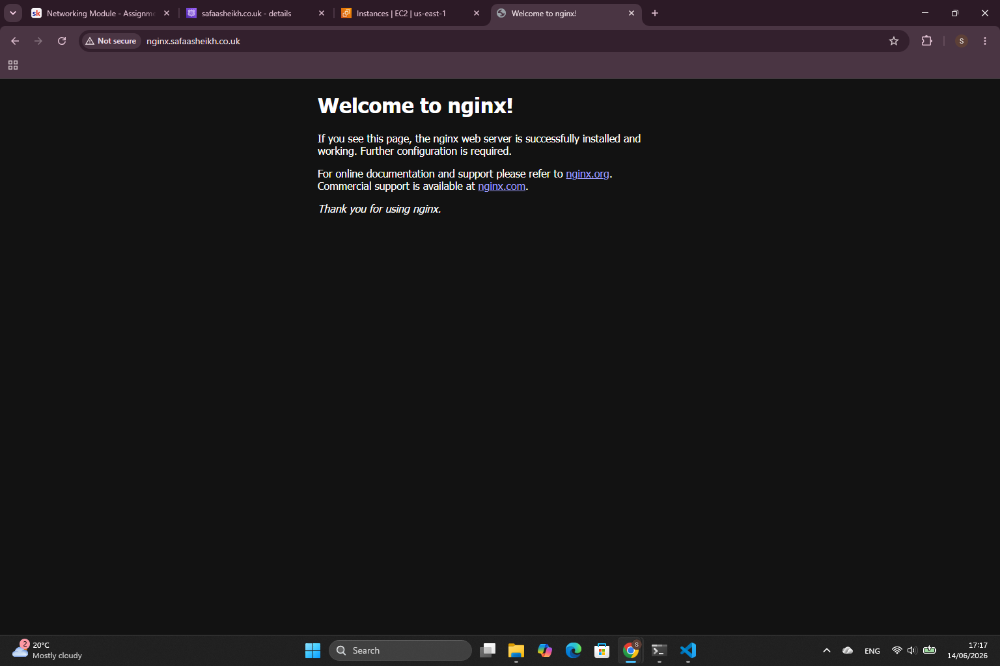

# Networking Assignment - Domain + EC2 + DNS

## Objective

This project connects core networking concepts through purchasing a domain, deploying an NGINX web server on an EC2 instance, and making the page load over a custom domain. In plain terms - building the infrastructure a website lives on.

## Overview

User Browser
     ↓
nginx.safaasheikh.co.uk (DNS A record)
     ↓
Route 53 (DNS resolution)
     ↓
EC2 Public IP
     ↓
NGINX (port 80)
     ↓
NGINX Default Welcome Page

## Tech Used
- AWS Route 53 (domain registration + DNS)
- AWS EC2 (Ubuntu 26.04 LTS, t2.micro)
- NGINX
- SSH / PowerShell

## What I did

### Step 1: Bought a Domain (Route 53)

- Registered safaasheikh.co.uk directly through AWS Route 53
- Route 53 automatically created a public hosted zone for the domain



### Step 2: Launched an EC2

- Launched an Ubuntu Server 26.04 LTS instance (t2.micro)
- Created a new key pair (.pem) for SSH access
- Configured a security group with the following inbound rules:



### Step3: Installed and Configured NGINX

- Connected to the instance via SSH from PowerShell using:

``` bash
ssh -i nginx-key.pem ubuntu@<EC2_PUBLIC_IP>
```
- Installed and started NGINX using:

``` bash
sudo apt update 
sudo apt install -y nginx
sudo systemctl enable nginx
sudo systemctl start nginx
```
- Verified it was running using:

``` bash
sudo systemctl status nginx
```

### Step 4: Configured DNS (A record)
- In Route 53, created an A record:
   - Name: nginx
   - Type: A
   - Value: EC2 public IPv4 address

This routes nginx.safaasheikh.co.uk → EC2 instance.



### Step 5: Testing and Verification
- Visited http://nginx.safaasheikh.co.uk in the browser and confirmed the NGINX default welcome page loads successfully



## Problem I encountered

I got stuck trying to SSH into my EC2 instance. My .pem key was sitting on my Windows desktop, and I kept trying to drag it straight into the Ubuntu terminal, forgetting these were two completely different machines so that obviously wasn't going to work. Took me a minute to realise I just needed to run the SSH command from PowerShell on my own machine and point it at the key's actual location. Once I fixed the file path, it connected straight away.

## Summary

This was one of the assignments I was actually looking forward to, and I had fun figuring most of it out as I went. So that's my first ever web server launch done. What that means is, I built the infrastructure a website lives on, and now anyone can reach it through my own domain.


